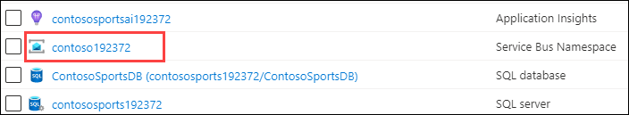
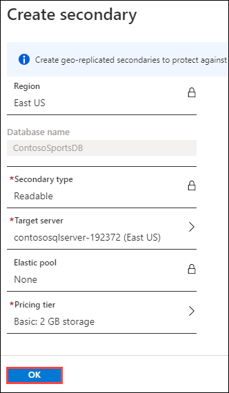
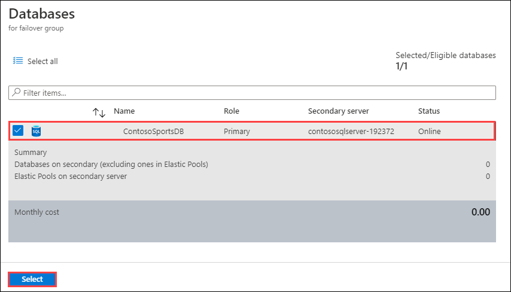

## Exercise 1: Proof of concept deployment

Duration: 60 minutes

Contoso has asked you to create a proof of concept deployment in Microsoft Azure by deploying the web, database, and API applications for the solution as well as validating that the core functionality of the solution works. Ensure all resources use the same resource group previously created for the App Service Environment.

### Task 1: Deploy the e-commerce website, SQL Database, and storage

In this exercise, you will provision a website via the Azure **Web App + SQL** template using the Microsoft Azure Portal. You will then edit the necessary configuration files in the starter project and deploy the e-commerce website.

#### Subtask 1: Configure SQL Database Firewall and Retrieve Connection String

1. Navigate to the Azure Management portal, [http://portal.azure.com](http://portal.azure.com/), using a new tab or instance and login with your lab-provided Azure credentials.

2. Navigate to the **contososports** resource group.

3. Select the **ContosoSportsDB** SQL Database.

  

4. On the **SQL Database** blade, select the **Show database connection strings** link.

  

5. On the **Database connection strings** blade, select and copy the **ADO.NET** connection string. Then, save it in **Notepad** for use later, being sure to replace the placeholders with your username and password with **demouser** and **demo@pass123**, respectively.

  

6. Go back to the **contososports** resource group blade, and select the **contososports** SQL Server.

  

7. On the **Overview** screen of the **SQL Server** blade, select **Set server firewall** link at the top.

  

8. On the **Firewall Settings** blade, specify a new rule named **ALL**, with START IP **0.0.0.0**, and END IP **255.255.255.255**.

  

    >**Note**: This is only done to make the lab easier to do. In production, you do **NOT** want to open your SQL Database to all IP Addresses this way. Instead, you will want to specify just the IP Addresses you wish to allow through the Firewall.

9. Select **Save**.

  

10. Update progress can be found by selecting the **Notifications** link located at the top of the page.

    

11. Close all configuration blades.

#### Subtask 2: Retrieve Storage Account Access Keys

1. Go back to the **contososports** blade resource group, and select the **contoso** Storage account.

2. On the **Storage account** blade, scroll down, and, under the **SETTINGS** menu area, select the **Access keys** option.

On the **Access keys** blade, select the copy button by the **Connection String** field in the **key1** section. Paste the value into **Notepad** for later usage. 

  

#### Subtask 3: Retrieve Service Bus Queue Connection String

1. Go back to the **contososports** blade resource group, and select the **contoso** Service Bus Namespace.

  

2. Select the **Queues** link under Entities.

    

3. On the **Queues** pane, select the **receiptgenerator** Service Bus Queue.

  

4. On the **receiptgenerator** Service Bus Queue blade, select the **Shared access policies** link under Settings. Then open the **Publisher** shared access policy.

  

>**Note**: The _Publisher_ and _Listener_ shared access policies for the Azure Service Bus Queue were deployed as part of the ARM Template that was used to setup the lab environment. As you can see, the **Publisher** policy that we're copying the connection string for, only has permissions to _Send_ messages to the queue.
    >
    > By default, no policies are created. Additionally, it is best practice to use least privilege security to create separate shared access policies for publishers sending messages and listeners receiving messages from the queue. 

6. On the **SAS Policy** pane, copy the **Primary Connection String**. Paste the value into **Notepad** for later usage. 

  

#### Subtask 4: Update the configuration in the starter project

1. Go back to the **contososports** resource group blade.

2. Select the **contosoapp** web app (**App Service** type).

  

3. Copy the web app URL to Notepad.

    - Select the **Overview** link.
    - Copy the URL to Notepad for later use. Use the **Copy to clipboard** link.

  

4. On the **App Service** blade, scroll down in the left pane. Under the **Settings** menu, select **Configuration**.

    

5. Add a new **Application setting** with the following values:

   - Key: `AzureQueueConnectionString`

   - Value: Enter the Connection String for the **Azure Service Bus Queue** just created.

  

6. Locate **Connection Strings** section below **Application Settings**.

  

7. Add a new **Connection String** with the following values:

   - Name: `ContosoSportsLeague`

   - Value: **Enter the Connection String for the SQL Database just created**.

   - Type: `SQLAzure`

    >**Important**: Ensure you replace the string placeholder values **{your\_username}** **{your\_password\_here}** with the username and password you setup during previously.

  

8. Select **Save**.

  

#### Subtask 5: Deploy the e-commerce Web App from Visual Studio

1. Navigate to the **Contoso.Apps.SportsLeague.Web** project located in the **Web** folder using the **Solution Explorer** of Visual Studio. Right-click the **Contoso.Apps.SportsLeague.Web** project, and select **Publish**.

    

2. Click on **Start** button.

  

3. Choose **Azure - Publish your application to the Microsoft cloud**.

  

4. Now choose **Azure App Service (Windows)**.

  

5. Select the **Contoso Sports Web App** (with the name you created previously) and click on **Finish**.

  

6. Select **Publish** to publish the Web application.

  

7. In the Visual Studio **Web Publish Activity** view, you will see a status that indicates the Web App was published successfully.

  

    >**Note**: Your URL will differ from the one shown in the Output screenshot because it must be globally unique.

8. A new browser should automatically open the new web applications. Validate the website by choosing the **Store** link on the menu. You should see product items. If products are returned, then the connection to the database is successful.

    

    >**Troubleshooting**: If the web site fails to show products, go back and double check all your connection string entries and passwords web application settings.

### Task 2: Setup SQL Database Geo-Replication

In this exercise, the attendee will provision a secondary SQL Database and configure Geo-Replication using the Microsoft Azure Portal.

#### Subtask 1: Add secondary database

1. Using a new tab or instance of your browser, navigate to the Azure Management Portal <http://portal.azure.com>.

2. Select **SQL databases** in the navigation menu to the left, and select the name of the SQL Database you created previously.

    

3. Under the **SETTINGS** menu area, select **Geo-Replication**.

    

4. Select the Azure Region to place the Secondary within.

    

    The Secondary Azure Region should be the Region Pair for the region the SQL Database is hosted in. Consult <https://docs.microsoft.com/en-us/azure/best-practices-availability-paired-regions> to see which region pair the location you are using for this lab is in.

    >**Note**: If you choose a region that cannot be used as a secondary region, you will not be able to pick a pricing plan. Choose another region.
    > 
    > 

5. On the **Create secondary** blade, select **Secondary Type** as **Readable**.

6. Select **Target server** ***Configure required settings***.

    

7. On the **New server** blade, specify the following configuration and then click on **Select**.

   - Server name: **contososqlserver-{uniqueid} (for example:contososqlserver-192372  )**.

   - Server admin login: **demouser**

   - Password and Confirm Password: **demo@pass123**

  

8. On the **Create secondary** blade, select **OK**.

  

    > **Note**: The Geo-Replication will take a few minutes to complete.

9. After the Geo-Replication has finished provisioning, select **SQL Databases** in the navigation menu to the left.

    

10. Select the name of the Secondary SQL Database you just created.

  

11. On the SQL database blade in the Essentials section, select the SQL Database Server name link.

  

12. On the **SQL Server** blade, within the **Overview** pane, select **Show firewall settings** link.

  

13. On the **Firewall Settings** blade, specify a new rule named **ALL**, with START IP **0.0.0.0**, and END IP **255.255.255.255**.

  

    >**Note**: This is only done to make the lab easier to do. In production, you do **NOT** want to open your SQL Database to all IP Addresses this way. Instead, you will want to specify just the IP Addresses you wish to allow through the Firewall.

14. Select **Save**.

  

15. Update progress can be found by choosing the **Notifications** link located at the top of the page.

    

16. Close all configuration blades.

#### Subtask 2: Setup SQL Failover Group

With SQL Database Geo-Replication configured, the Azure SQL Failover Groups feature can be used to enable "auto failover" scenarios for the SQL Database. This enables a single connection string endpoint to be used by the application, and SQL Database will automatically handle failing over from Primary to Secondary database in the event of a SQL Database outage / down time.

1. Using a new tab or instance of your browser, navigate to the Azure Management Portal <http://portal.azure.com>.

2. In the navigation menu to the left, select **SQL databases**, and select the name of the *primary* SQL Database you created previously.

    

3. On the **SQL database** blade, within the **Overview** pane, select the **Server name**.

  

4. On the **SQL server** blade, select **Failover groups** under **Settings** and then click on the **Add group** button.

  

5. On the **Failover group** pane:

 - Enter **contosofailovergroup-{uniqueid}**.
 - Select **Secondary server**, then choose the **Secondary SQL Database** that was previously created.

  
  
 - Select **Database within the group**, then choose the **ContosoSportsDB** database, then click **Select**.

  

6. Review and then select **Create** to create the SQL Failover Group.

  

7. Once the Failover Group has been created, select it in the list.

  

8. Notice, on the **Failover group** pane, the map and display showing the _Primary_ and _Secondary_ SQL Database servers within the failover group. The _Primary_ database shows as **Automatic** failover for Read/Write of data, while the _Secondary_ database doesn't since it is currently Read only.

  

9. Scroll down, below the map, to where the **Read/write listener endpoint** and **Read-only listener endpoint** are displayed. These allow for applications to be configured to connect to the SQL Failover Group endpoints instead of the individual SQL Server endpoints.

    Copy both **Listener Endpoint** values for later reference.

  

10. Go back to the **contososports** resource group blade.

11. Select the **contosoapp** web app (**App Service** type).

  

12. On the **App Service** blade, scroll down in the left pane. Under the **Settings** menu, select **Configuration**.

    

13. Locate the **Connection Strings** section, and modify the value of the **ContosoSportsLeague** connection string to include the **Azure SQL Failover Group Read/Write Listener Endpoint** that was copied previously.

    > Note: The connection string will need to be in the following format:
    > ```
    > Server=tcp:{failover_group_endpoint};Initial Catalog=ContosoSportsDB;Persist Security Info=False;User ID={your_username};Password={your_password_here};MultipleActiveResultSets=False;Encrypt=True;TrustServerCertificate=False;Connection Timeout=30;
    > ```
    >
    > Be sure to replace the string placeholder values **{your_username}**, **{your_password_here}**, and **{failover_group_endpoint}** with the username, password, and read/write listener endpoint for the SQL Database Failover Group. The username and password will remain the same as they were for the SQL Server.

14. Select **Save**.

#### Subtask 3: Failover SQL Database Failover Group

>**Note**: This subtask is optional.

Since the Replication and Failover process can take anywhere from 10 to 30 minutes to complete, you have the choice to skip Subtask 3 and 4, and go directly to Task 3. However, if you have the time, it is recommended that you complete these steps.

1. Using a new tab or instance of your browser, navigate to the Azure Management Portal <http://portal.azure.com>.

2. In the navigation menu to the left, select **SQL databases**, and select the name of the *primary* SQL Database you created previously.

    

3. On the **Overview** pane, select the **Server name**.

  

4. On the **SQL server** blade, select **Failover groups** under Settings then click on the **Failover group** in the list

  

5. On the Failover group blade, select the **Forced Failover** button, then select **Yes** to confirm the forced failover of the SQL Database Failover Group.

  

The failover may take a few minutes to complete. You can continue with the next Subtask.

#### Subtask 4: Test e-commerce Web App after Failover

1. From the Azure portal, select **Resource Groups**, and select **contososports**.

2. Select the **Web App** created earlier.

3. On the **App Service** blade, select **Overview**.

    

4. On the **Overview** pane, select the **URL** for the Web App to open it in a new browser tab.

    

5. After the e-commerce Web App loads in Internet Explorer, select **STORE** in the top navigation bar of the website.

    

6. Verify the product list from the database displays.

    

### Task 3: Deploying the Call Center admin website

In this exercise, you will provision a website via the Azure Web App template using the Microsoft Azure Portal. You will then edit the necessary configuration files in the Starter Project and deploy the call center admin website.

#### Subtask 1: Provision the call center admin Web App

1. Using a new tab or instance of your browser, navigate to the Azure Management portal <http://portal.azure.com>.

2. Select **+Create a resource** then select **Web**, then **Web App**.

3. Specify a **unique URL** for the Web App, **resource group** you have used throughout the lab are selected. Also, specify **.NET Core 3.1 (LTS)** as the **Runtime stack**.

    

4. Select **Linux Plan**, and create a new Linux-based App Service Plan for the Web App.

5. After the values are accepted, select **Review and create**, then **Create**.  It will take a few minutes to provision.

#### Subtask 2: Update the configuration in the starter project

1. Navigate to the **App Service** blade for the Call Center Admin App just provisioned.

    

2. On the **App Service** blade, select **Configuration** in the left pane.

    

3. Scroll down, and locate the **Connection strings** section.

4. Add a new **Connection string** with the following values:

    - Name: `ContosoSportsLeague`

    - Value: **Enter the Connection String for the SQL Database Failover Group Read/Write Listener Endpoint**.

    - Type: `SQL Azure`

    

5. Select the **Update** button.

6. Select the **Save** button.

    

#### Subtask 3: Deploy the call center admin Web App from Visual Studio

1. Navigate to the **Contoso.Apps.SportsLeague.Admin** project located in the **Web** folder using the **Solution Explorer** in Visual Studio.

2. Right-click the **Contoso.Apps.SportsLeague.Admin** project, and select **Publish**.

    

3. Choose **App Service Linux** as the publish target, choose **Select Existing**, then select **Create Profile**.

    

4. Select the **Web App** for the Call Center Admin App.

    

5. Select **OK**.

6. Select **Publish**.

    

6. Once deployment is complete, navigate to the Web App. It should look like the following:

    

### Task 4: Deploying the payment gateway

In this exercise, the attendee will provision an Azure API app template using the Microsoft Azure Portal. The attendee will then deploy the payment gateway API to the API app.

#### Subtask 1: Provision the payment gateway API app

1. Using a new tab or instance of your browser, navigate to the Azure Management Portal <http://portal.azure.com>.

2. Select **+Create a resource**, type **API App** into the marketplace search box, and press **Enter**.  Select the **Create** button.

    

3. On the new **API App** blade, create the following values:

   - **App name:** Specify a unique name for the App Name.
   - **Subscription:** Your Azure MSDN subscription.
   - **Resource Group:** Select **Use existing** option.
   - **App Service Plan/Location** Select the same primary region used in previous steps.
   - **Application Insights:** **Disabled**

    

4. After the values are accepted, select **Create**.  It will take a few minutes to provision.

#### Subtask 2: Deploy the Contoso.Apps.PaymentGateway project in Visual Studio

1. Navigate to the **Contoso.Apps.PaymentGateway** project located in the **APIs** folder using the **Solution Explorer** in Visual Studio.

2. Right-click the **Contoso.Apps.PaymentGateway** project, and select **Publish**.

    

3. On the **Publish Web** dialog box, select **Azure App Service**, then choose **Select Existing**, and **Create Profile**.

    > **Note**: If your Azure resource group does not show, choose **New Profile**.

4. Select the Payment Gateway API app created earlier, select **OK**.

    

5. Select **Publish**.

6. In the Visual Studio **Output** view, you will see a status indicating the Web App was published successfully.

    

7. Copy and paste the gateway **URL** of the deployed **API App** into Notepad for later use.

8. Viewing the Web App in a browser will display the Swagger UI for the API.

   

### Task 5: Deploying the Offers Web API

In this exercise, the attendee will provision an Azure API app template using the Microsoft Azure Portal. The attendee will then deploy the Offers Web API.

#### Subtask 1: Provision the Offers Web API app

1. Using a new tab or instance of your browser, navigate to the Azure Management Portal (<http://portal.azure.com>).

2. Select **+Create a resource**, type **API App** into the marketplace search box, and press **Enter**.  Select the **Create** button.

3. On the new **API App** blade, specify a unique name for the **API App**, and ensure the previously used Resource Group and App Service Plan are selected.

    

4. After the values are accepted, select the **Create** button.

5. When the Web App template has completed provisioning, open the new API App by, in the navigation menu to the left, select **App Services** and then the Offer API app you just created.

   

#### Subtask 2: Configure Cross-Origin Resource Sharing (CORS)

1. On the **App Service** blade for the Offers API, under the **API** menu section, scroll down and select **CORS**.

    

2. In the **Allowed Origins** text box, specify `*` to allow all origins, and select **Save**.

    >**Note**: You should not normally do this in a production environment. In production, you should enter the specific domains as allowed origins you need to allow CORS access to the API. The wildcard (*) is used for this lab to make it easier just for this lab.

    

#### Subtask 3: Update the configuration in the starter project

1. On the **App Service** blade for the Offers API, select **Configuration**.

    

2. In the **Connection Strings** section, add a new **Connection string** with the following values:

      - Name: `ContosoSportsLeague`

      - Value: **Enter the Connection String for the SQL Database Failover Group Read-only Listener Endpoint**.

      - Type: `SQL Azure`

        

        >**Note**: The Connection String for the SQL Database Failover Group Read-only Listener Endpoint will be in the following format:
        >
        > ```
        > Server=tcp:{failover_group_endpoint};Initial Catalog=ContosoSportsDB;Persist Security Info=False;User ID={your_username};Password={your_password_here};MultipleActiveResultSets=False;Encrypt=True;TrustServerCertificate=False;Connection Timeout=30;
        > ```
        >
        > Ensure you replace the string placeholder values **{your\_username}**, **{your\_password\_here}**, and **{failover_group_endpoint}** with the username, password, and Failover Group Read-only Listener Endpoint you respectively setup during creation (demouser & demo@pass123).
        >
        > 
        >
        > The SQL Failover Group Read-only Listener Endpoint will be the DNS name that ends in `.secondary.database.windows.net`. You will have copied this previously when setting up the SQL Failover Group.

3. Select the **Update** button.

4. Select the **Save** button.

    

#### Subtask 4: Deploy the Contoso.Apps.SportsLeague.Offers project in Visual Studio

1. Navigate to the **Contoso.Apps.SportsLeague.Offers** project located in the **APIs** folder using the **Solution Explorer** in Visual Studio.

2. Right-click the **Contoso.Apps.SportsLeague.Offers** project, and select **Publish**.

    

3. On the **Publish Web** dialog box, select **Azure App Service**, choose **Select Existing**, and select **Create Profile**.

    

4. Select the Offers API app created earlier, and select **OK**.

    

5. Select **Publish**.

6. In the Visual Studio **Output** view, you will see a status the API app was published successfully.

7. Record the value of the deployed API app URL into Notepad for later use.

8. Viewing the Web App in a browser will display the Swagger UI for the API.

    

9. Within the Swagger UI for the Offers API, select the `/api/get` method on the API. Then select the **Try it out** button, and then **Execute** to test out the API call from within the Swagger UI in the web browser. Once it executes, scroll down to view the results of the API call execution.

    

### Task 6: Update and deploy the e-commerce website

#### Subtask 1: Update the Application Settings for the Web App that hosts the Contoso.Apps.SportsLeague.Web project

1. Using a new tab or instance of your browser, navigate to the Azure Management Portal <http://portal.azure.com>.

2. Select **Resource groups** then the **contososports** resource group.

3. Select the **App Service Web App** for the front-end web application.

    

4. On the **App Service** blade, scroll down, and select **Configuration** in the left pane.

    

5. Scroll down, and locate the **Applications settings** section.

6. Add a new **Application Setting** with the following values:

   - App Setting Name: `paymentsAPIUrl`

   - Value: Enter the **HTTPS** URL for the Payments API App with `/api/nvp` appended to the end.

        >**Example**: `https://paymentsapi0.azurewebsites.net/api/nvp`

    

7. Add another **Application Setting** with the following values:

   - App Setting Name: `offersAPIUrl`

   - Value: Enter the **HTTPS** URL for the Offers API App with `/api/get` appended to the end.

    >**Example**: `https://offersapi4.azurewebsites.net/api/get`

    

    >**Note**: Ensure both API URLs are using **SSL** (https://), or you will see a CORS errors.

8. Select **Save**.

#### Subtask 2: Validate App Settings are correct

1. On the **App Service** blade, select **Overview**.

    

2. In the **Overview** pane, select the **URL** for the Web App to open it in a new browser tab.

    

3. On the homepage, you should see the latest offers populated from the Offers API.

    

4. Submit several test orders to ensure all pieces of the site are functional.  **Accept the default data during the payment processing.**

    

>**Leader Note**: If the attendee is still experiencing CORS errors, ensure the URLs to the Web App in Azure local host are exact.

5. Click on **Next** button.
