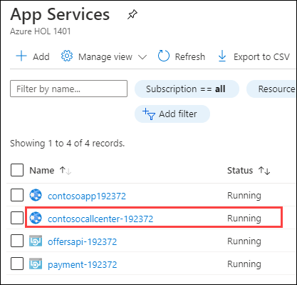
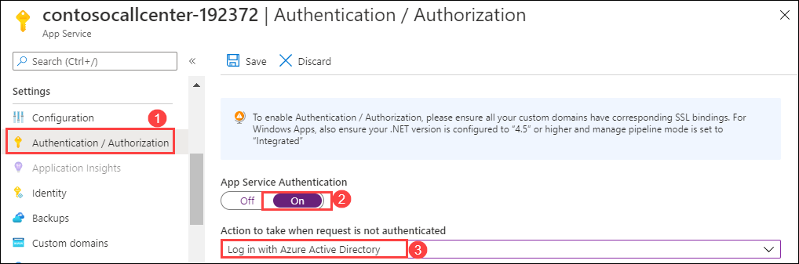
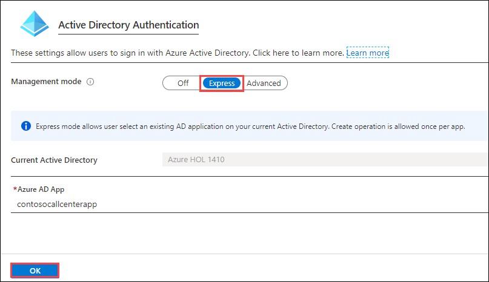
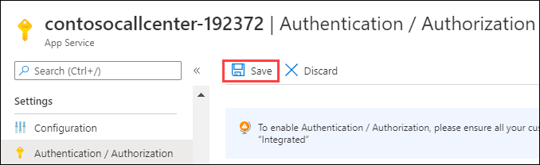

## Exercise 2: Identity and Security

Duration: 75 Minutes

The Contoso call center admin application will only be accessible by users of the Contoso Active Directory environment. You have been asked to create a new Azure AD Tenant and secure the application so only users from the tenant can log on.

### Task 1: Enable Azure AD Premium Trial

>**Note**: This task is **optional**, and it is valid only if you are a global administrator on the Azure AD tenant associated with your subscription.

1. Navigate to the Azure Management portal, [http://portal.azure.com](http://portal.azure.com/), using a new tab or instance.

2. In the left-hand navigation menu, select **Azure Active Directory**.

    

3. On the **Azure Active Directory** blade, locate and select the **Company branding** option.

    

4. In the right pane, select the **Get a free Premium trial...** link.

    

    If you already have a Premium Azure Active Directory, skip to Task 2.

5. On the **Activate** blade, select the **Free Trial** link within the **Azure AD Premium P2**, then select **Activate**.

    

6. Close the **Azure Active Directory** blades.

### Task 2: Create a new Contoso user

>**Note**: This task is **optional**, and it is valid only if you are a global administrator on the Azure AD tenant associated with your subscription.

1. Navigate to the Azure Management portal, [http://portal.azure.com](http://portal.azure.com/), using a new tab or instance.

2. Select **Azure Active Directory** in the navigation menu to the left.

    

3. On the **Azure Active Directory** blade, select **Custom Domain names**.

    

4. Copy the **Domain Name** for your Azure AD Tenant. It will be in the format: *[your tenant\].onmicrosoft.com*.
    This will be used for creating the new user's Username.

    

5. On the **Azure Active Directory** blade, select **Users**.

    

6. Select **+ New user** to add a new user.

    

7. On the **User** blade, specify a user's **Name** and **User name**. Specify the **User name** to be at the domain name for your Azure AD Tenant. For example: *tbaker@\[your tenant\].onmicrosoft.com*.

    

8. Select the **Show Password** checkbox, and make a note of the password for use later.

    

9. Select **Create**.

    

### Task 3: Configure access control for the call center administration Web Application

>**Note**: This task is **optional**, and it is valid only if you have the right to create applications in your Azure AD Tenant.

#### Subtask 1: Enable Azure AD Authentication

1. On the left navigation of the Azure Portal, select **App Services**.

    

2. On the **App Services** blade, select the **Call Center Administration Web app**.

  

3. Select the **Authentication / Authorization** tile. Now change **App Service Authentication** to **On**, and change the **Action to take when request is not authenticated** option to **Login with Azure Active Directory**.

  

4. Select the **Azure Active Directory**.

    

5. On the **Azure Active Directory Settings** blade, change **Management mode** to **Express**. Then select **Ok**.

  

6. In the **Authentication / Authorization** blade, select **Save**.

  

#### Subtask 2: Verify the call center administration website uses the access control logon

1. Close your browser (or use an alternative), and launch a browser is **InPrivate or Incognito mode**. Navigate to the **Call Center Administration** website.

2. The browser will redirect to the non-branded Access Control logon URL. You can log on with your Microsoft account or the **Contoso test user** you created earlier.

    

3. After you log on and **accept the consent**, your browser will be redirected to the Contoso Sports League Admin webpage.

    

4. Verify in the upper-right corner you see the link **Logged In**. If it is not configured, you will see **Sign in**.

     

### Task 4: Apply custom branding for the Azure Active Directory logon page

>**Note**: this task is **optional**, and it is valid only if you are a global administrator on the Azure AD tenant associated with your subscription, and you completed the Enabling Azure AD Premium exercise.

1. Navigate to the Azure Management portal, [http://portal.azure.com](http://portal.azure.com/), using a new tab or instance.

2. In the navigation menu to the left, select **Azure Active Directory**.

    

3. On the **Azure Active Directory** blade, select **Company branding**.

    

4. Select the **Configure...** information box.

    

5. On the **Configure company branding** blade, select the `default_signin_illustration.jpg` image file from `C:\MCW` for the **Sign-in page image**.

    

6. Select the `logo-60-280.png` image file from the supplementary files for the **Banner image**.

    

7. Select **Save**.

    

### Task 5: Verify the branding has been successfully applied to the Azure Active Directory logon page

1. Close any previously authenticated browser sessions to the call center administration website, reopen using InPrivate or Incognito mode, and navigate to the **call center administration** website.

2. The browser will redirect to the branded access control logon URL.

    

3. After you log on, your browser will be redirected to the Contoso Sports League Admin webpage.

    

4. Verify in the upper-right corner you see the link **Logged in**.

    

    >**Note**: If you run the app using localhost, ensure connection strings within all the appsettings.json files in the solution have the placeholders removed with actual values. Search on appsettings.json in the Visual Studio Solution Explorer to come up with the list.

5. Click on **Next** button.
