## Exercise 3: Enable Azure B2C for customer site

Duration: 75 minutes

In this exercise, you will configure an Azure AD Business to Consumer (B2C) instance to enable authentication and policies for sign-in, sign-out and profile policies for the Contoso E-Commerce site.

### Task 1: Create a new directory

1. Log in to the Azure portal by using your existing Azure subscription or by starting a free trial. In the left-hand navigation menu, select **+Create a resource**. Then, search for and select **Azure Active Directory B2C** and select **Create** on the new blade that pops up.

    

2. In the new blade, select **Create a new Azure AD B2C Tenant**. Then, enter the name as **ContosoB2C** and a unique domain name and region. Then, select **Create**. After directory creation completes, select the link in the new information tile that reads **Click here to manage your new directory**.

    

    

3. Select the orange **No Subscription** message for instructions on how to link to an active subscription.

    

    

    >**Note**: Essentially, you will need to switch back to your previous Azure AD tenant, and then launch the Azure AD B2C creation wizard again.

4. Select **Link an existing Azure AD B2C Tenant to my Azure subscription,** and select the Tenant you just created in the dropdown list and the existing resource group **contososports-01**. Then, select **Create**.

    

5. After creation completes, open the new Azure AD B2C tenant by selecting **Resource Groups** > **contososports-01** in the navigation menu to the left. Then, in the new blade, select the B2C tenant you just created.

    

6. In the new blade, select the **B2C Settings** tile for the new B2C tenant. You will be taken to the new subscription for this tenant.

  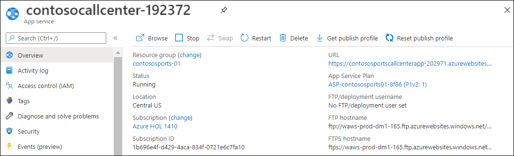

7. In the new tab that opened, under the **MANAGE** menu area of the open **Azure AD B2C** blade, select **Applications**. Then, in the new pane, select **+Add**.

    

### Task 2: Add a new application

1. Specify the following configuration options for the Web App:

   - Name: **Contoso B2C Application-uniqueid**

   - Include Web App / web API: **Yes**

   - Allow Implicit Flow: **Yes**

   - Reply URL: `https://[your web url].azurewebsites.net/signin-oidc-b2c` _(This should be the HTTPS URL to the Contoso E-Commerce Site.)_

  

2. Select **Create**.

3. Back on the **Azure AD B2C** blade in the **Applications** screen, copy the application ID of your new application to Notepad to use later. Keep this tab open for the next task.

  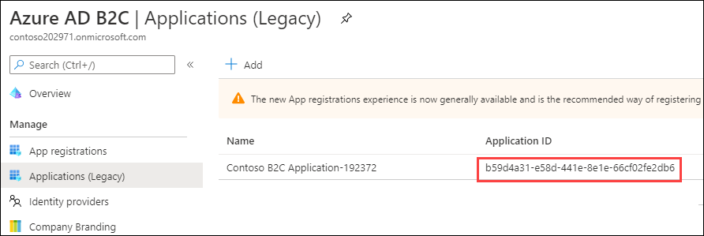

### Task 3: Create Policies, Sign up and sign in

1. Navigate back to the **Azure AD B2C** blade that was opened in the last task.

2. To enable sign-up on your application, you will need to create a sign-up policy. This policy describes the experiences consumers will go through during sign-up and the contents of tokens the application will receive on successful sign-ups. Select **User flows** link on the left menu and then **+New user flow** link at the top of the blade.

  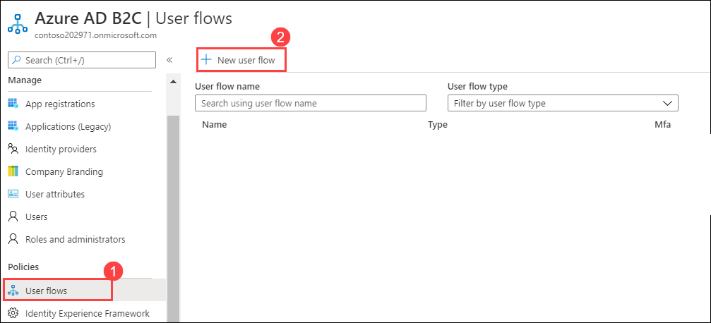

3. Select the **Sign up and sign in** link.
  
  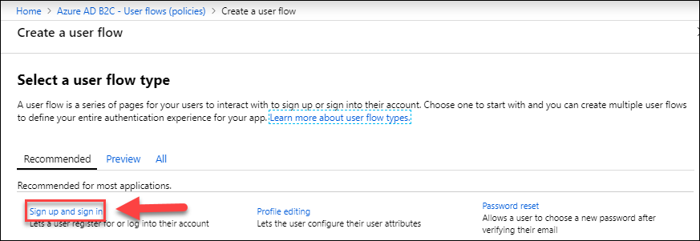

4. Enter **SignUp** in the **Name** field.

  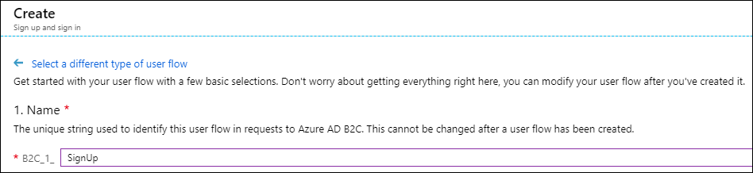

5. Select **Identity providers**, and select **Email Signup**. Optionally, you can also select social identity providers (if previously configured for the tenant). Select **OK**.

  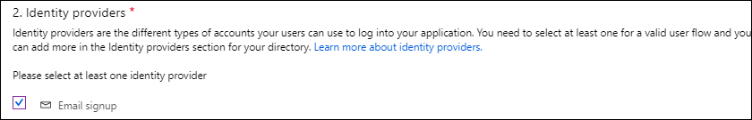

6. **Multifactor authentication** set to **Disabled**.

7. **User attributes and claims**.
    - Select the **Show more...** link.

  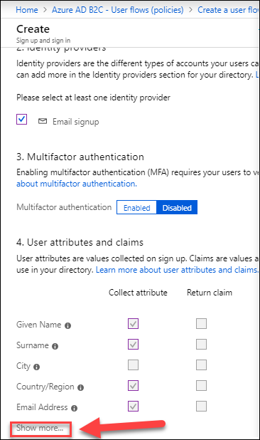

8. Select the following **Collect attributes**:

    - **Country/Region**
    - **Display Name**
    - **Postal Code**

9. Select the following **Return claims**:

    - **Display Name**
    - **Identity Provider**
    - **Postal Code**
    - **User is new**
    - **User's Object ID**
  
10. Review your selections, select **OK**.

  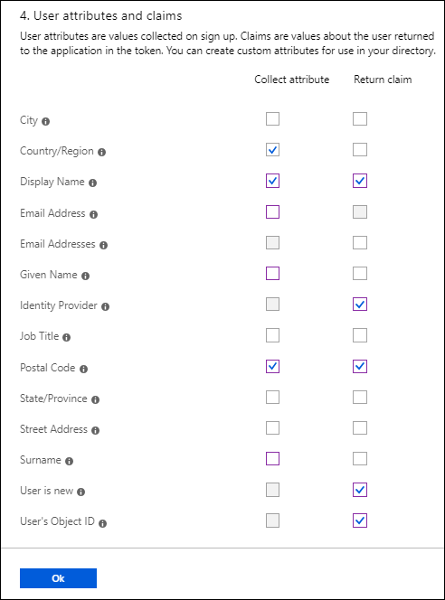

11. Select **Create**. Observe the policy just created appears as **B2C\_1\_SignUp** (the **B2C\_1\_** fragment is automatically added) in the **Sign-up policies** blade.

    >**Note**: The page may take a few minutes to load/refresh after you start creating the policy.

  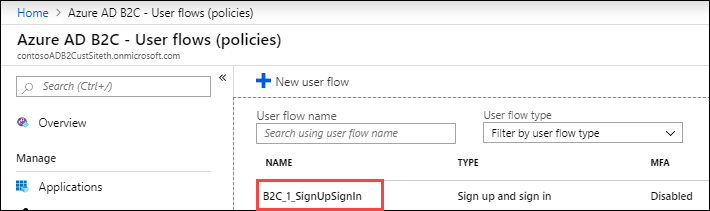

12. Open the policy by selecting the link in the list e.g. **B2C\_1\_SignUp**.

13. Select **Run user flow** and open the dialog.

  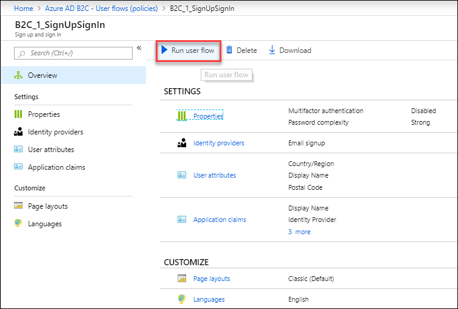

14. Select **Run user flow** - Choose application and run user flow. 

    

15. A browser tab/window will open that looks like the following screenshot.

    
    
16. Select **Sign up now**.

    

### Task 4: Create a profile editing policy

To enable profile editing on your application, you will need to create a profile editing policy. This policy describes the experiences that consumers will go through during profile editing and the contents of tokens that the application will receive on successful completion.

1. Select **User flows** link on the left blade.

2. Select **+ New user flow** link at the top of the blade.

3. Select the **All** tab link.

  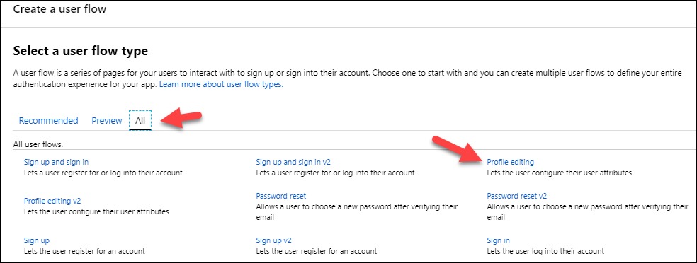

4. Select **Profile editing**.

5. The Name determines the profile editing policy name used by your application. For example, enter **EditProfile**.

  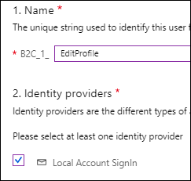

6. Select Identity providers, and then "**Local Account SignIn**."

7. Select the **Show more...** link.

8. Select **Collect attributes**. Here, you choose attributes the consumer can view and edit.

    For now, select the following:

    - **Country/Region**
    - **Display Name**
    - **Job Title**
    - **Postal Code**
    - **State/Province**
    - **Street Address**

9. Select **Return claims**. Here, you choose claims you want returned in the tokens sent back to your application after a successful profile editing experience.

    For now, select the following:

    - **Display Name**
    - **Postal Code**

  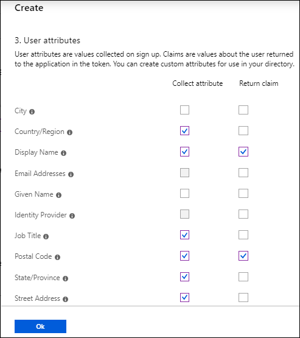

10. Select **OK**.

11. Select **Create**. Observe the policy just created appears as \"**B2C\_1\_EditProfile**\" (the **B2C\_1\_** fragment is automatically added) in the **Profile editing policies** blade.

12. Open the policy by selecting **B2C\_1\_EditProfile**, then **Run user flow**.

13. Select **Contoso B2C application** in the **Select Application** drop-down.

14. Select **Run user flow**. A new browser tab opens, and you can run through the profile editing consumer experience in your application.

### Task 5: Create a password reset policy

To enable profile editing on your application, you will need to create a profile password reset. This policy describes the experiences that consumers will go through during password reset and the contents of tokens that the application will receive on successful completion.

1. Select **User flows** link on the left blade.

2. Select **+ New user flow** link at the top of the blade.

3. Select **Password reset**.

  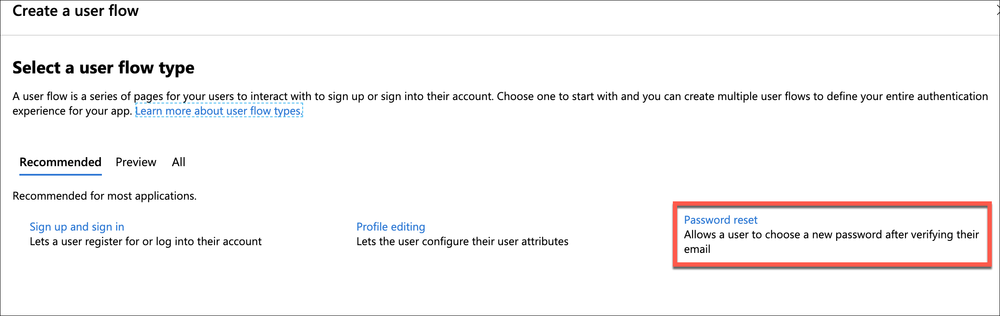

4. The Name determines the profile editing policy name used by your application. For example, enter **SSPR**.

  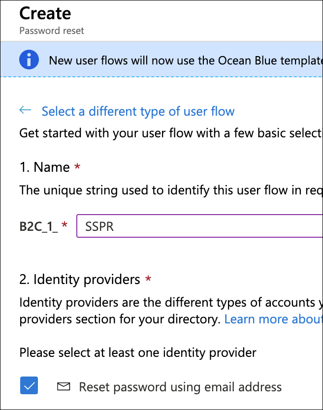

5. Select Identity providers, and then "**Reset password using email address**."

6. Select the **Show more...** link.

7. Select **Return claim**. Here, you choose attributes about the user that are returned to the application in the token.

    For now, select the following:

    - **Email Addresses**
    - **Given Name**

  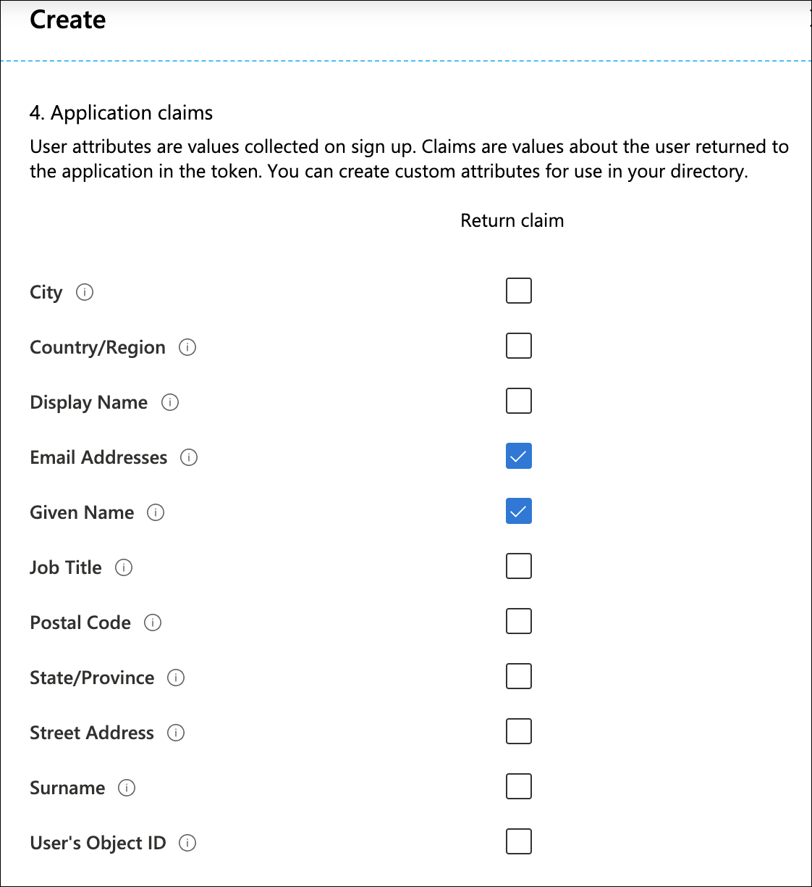

8. Select **OK**.

10. Select **Create**. Observe the policy just created appears as \"**B2C\_1\_SSPR**\" (the **B2C\_1\_** fragment is automatically added) in the **Profile editing policies** blade.

11. Open the policy by selecting **B2C\_1\_SSPR**, then **Run user flow**.

12. Select **Contoso B2C application** in the **Select Application** drop-down.

13. Select **Run user flow**. A new browser tab opens, and you can run through the profile editing consumer experience in your application.

### Task 6: Modify the Contoso.App.SportsLeague.Web

1. Expand the **Contoso.Apps.SportsLeague.Web** project. Find the **Startup.cs** code file, locate the `public void ConfigureServices(` method declaration, then add the following line of code to the bottom of this method:

    ```csharp
    services.AddAuthentication(Microsoft.AspNetCore.Authentication.AzureADB2C.UI.AzureADB2CDefaults.AuthenticationScheme)
                .AddAzureADB2C(options => Configuration.Bind("AzureADB2C", options));
    ```

    

2. Add the following `using` directives to the top of the **Startup.cs** code file:

    ```
    using Microsoft.AspNetCore.Authentication;
    using Microsoft.AspNetCore.Authentication.AzureADB2C.UI;
    ```

3. Locate the `app.UseAuthentication();` line within the `public void Configure` method, and add the following line of code after it:

    ```
    app.UseAuthentication();
    app.UseAuthorization();
    ```

    The result will look similar to the following:

    

4. Locate the Azure AD B2C name by navigating to your resource group. Copy the name to Notepad.

  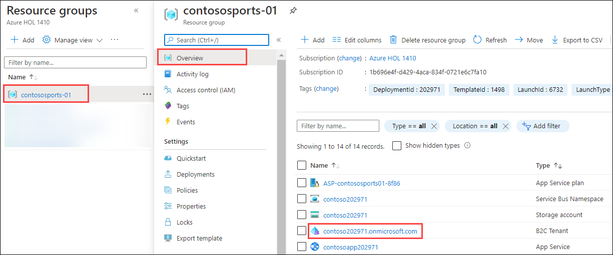

5. Next, using the Azure Management Portal, using your main subscription, open the Contoso Web App blade, and select **Configuration**.

6. Add the following settings in the **Application Settings** section:

   - AzureADB2C:Instance - `https://[your Azure AD B2C name].b2clogin.com/tfp/`
   - AzureADB2C:ClientId - **B2C Application ID you copied down earlier**.
   - AzureADB2C:CallbackPath - `/signin-oidc-b2c`
   - AzureADB2C:Domain - **[your Azure AD B2C name].onmicrosoft.com**
   - AzureADB2C:SignUpSignInPolicyId - `B2C_1_SignUp`
   - AzureADB2C:ResetPasswordPolicyId - `B2C_1_SSPR`
   - AzureADB2C:EditProfilePolicyId - `B2C_1_EditProfile`

7. Select **Save**.

### Task 7: Send authentication requests to Azure AD

Your app is now properly configured to communicate with Azure AD B2C by using ASP.NET Core Identity. OWIN has taken care of all of the details of crafting authentication messages, validating tokens from Azure AD, and maintaining user session. All that remains is to initiate each user's flow.

1. Right select the **Controllers** folder, and select **Add** -\> **Controller**.

    

2. Select **MVC Controller -- Empty** and then select **Add**. Replace **DefaultController** value with **AccountController** in the **Add Controller** dialog box.

    

3. Add the following using statement to the top of the controller:

    ```csharp
    using Microsoft.AspNetCore.Authentication;
    using Microsoft.AspNetCore.Authentication.AzureADB2C.UI;
    using Microsoft.AspNetCore.Mvc;
    using Microsoft.Extensions.Configuration;
    ```

4. Locate the default controller **Index** method.

    

    Replace the method with the following code, then **Save** the file:

    ```csharp
    // Controllers\AccountController.cs

    private string _editProfilePolicyId;

    public AccountController(IConfiguration configuration)
    {
        _editProfilePolicyId = configuration.GetValue<string>("AzureADB2C:EditProfilePolicyId");
    }

    public ActionResult SignIn()
    {
        if (!User.Identity.IsAuthenticated)
        {
            return Challenge(new AuthenticationProperties() { RedirectUri = "/" }, AzureADB2CDefaults.AuthenticationScheme);
        }
        return RedirectToAction("Index", "Home");
    }
            
    public ActionResult SignUp()
    {
        if (!User.Identity.IsAuthenticated)
        {
            return Challenge(new AuthenticationProperties() { RedirectUri = "/" }, AzureADB2CDefaults.AuthenticationScheme);
        }
        return RedirectToAction("Index", "Home");
    }

    public ActionResult Profile()
    {
        if (User.Identity.IsAuthenticated)
        {
                var properties = new AuthenticationProperties() { RedirectUri = "/" };
                properties.Items[AzureADB2CDefaults.PolicyKey] = _editProfilePolicyId;
                return Challenge(
                    properties,
                    AzureADB2CDefaults.AuthenticationScheme);
        }
        return RedirectToAction("Index", "Home");
    }

    public ActionResult SignOut()
    {
        if (!User.Identity.IsAuthenticated)
        {
            return RedirectToAction("Index", "Home");
        }
        string redirectUri = Url.Action("Index", "Home", null, Request.Scheme);
        var properties = new AuthenticationProperties
        {
            RedirectUri = redirectUri
        };
        return SignOut(properties, AzureADB2CDefaults.CookieScheme, AzureADB2CDefaults.OpenIdScheme);
    }
    ```

5. Save the file.

### Task 8: Display user information

When you authenticate users by using OpenID Connect, Azure AD returns an ID token to the app that contains **claims**. These are assertions about the user. You can use claims to personalize your app. You can access user claims in your controllers via the ClaimsPrincipal.Current security principal object.

1. Open the **Controllers\\HomeController.cs** file and add the following using statements at the end of the other using statements at the top of the file:

    ```csharp
    using Contoso.Apps.SportsLeague.Web.Models;
    using Microsoft.AspNetCore.Authorization;
    using Microsoft.AspNetCore.Mvc;
    using Microsoft.Extensions.Configuration;
    ```

2. Still in the **Controllers\\HomeController.cs** file, add the following method to the **HomeController** class:

    ```csharp
    [Authorize]
    public ActionResult Claims()
    {
        var displayName = User.Identity.Name;
        ViewBag.DisplayName = displayName;
        ViewBag.Claims = User.Claims;
        return View();
    }
    ```

3. You can access any claim that your application receives in the same way. A list of all the claims the app receives is available for you on the **Claims** page. In Visual Studio on the Contoso.Apps.SportsLeague.Web object, right-click on **Views -\> Home,** select **Add -\> View** and name it **Claims.**  Select **OK**.

    

4. Open the **Claims.cshtml** file and replace the code with the following:

    ```csharp
    @using System.Security.Claims
    @{
        ViewBag.Title = "Claims";
    }
    <h2>@ViewBag.Title</h2>

    <h4>Claims Present in the Claims Identity: @ViewBag.DisplayName</h4>

    <table class="table-hover claim-table">
        <tr>
            <th class="claim-type claim-data claim-head">Claim Type</th>
            <th class="claim-data claim-head">Claim Value</th>
        </tr>

        @foreach (Claim claim in ViewBag.Claims)
        {
            <tr>
                <td class="claim-type claim-data">@claim.Type</td>
                <td class="claim-data">@claim.Value</td>
            </tr>
        }
    </table>
    ```

5. Right-click on the **Views -\> Shared** folder, select **Add**, add a new **View**, and set it to **Create as a partial view**. Specify **\_LoginPartial** for the name.

    

    

6. Add the following code to the razor partial view to provide a sign-in and sign-out link as well as a link to edit the user's profile:

    ```html
    @if (User.Identity.IsAuthenticated)
    {
        <text>
            <ul class="nav navbar-nav navbar-right">
                <li>
                    <a id="profile-link">@User.Identity.Name</a>
                    <div id="profile-options" class="nav navbar-nav navbar-right">
                        <ul class="profile-links">
                            <li class="profile-link">
                                @Html.ActionLink("Edit Profile", "Profile", "Account")
                            </li>
                        </ul>
                    </div>
                </li>
                <li>
                    @Html.ActionLink("Sign out", "SignOut", "Account")
                </li>
            </ul>
        </text>
    }
    else
    {
        <ul class="nav navbar-nav navbar-right">
            <li>@Html.ActionLink("Sign up", "SignUp", "Account", routeValues: null, htmlAttributes: new { id = "signUpLink" })</li>
            <li>@Html.ActionLink("Sign in", "SignIn", "Account", routeValues: null, htmlAttributes: new { id = "loginLink" })</li>
        </ul>
    }
    ```

7. Open **Views\\Shared\\\_Layout.cshtml** in Visual Studio. Locate the header-top div, and add the line that starts with **@Html.ActionLink** and the line that starts with **@Html.Partial**.

    ```html
    <div class="header-top">
        <div class="container">
            <div class="row">
                <div class="header-top-left">
                <a href="#"><i class="fa fa-twitter"></i></a>
                <a href="#"><i class="fa fa-facebook"></i></a>
                <a href="#"><i class="fa fa-linkedin"></i></a>
                <a href="#"><i class="fa fa-instagram"></i></a>
                </div>
                <div class="header-top-right">
                    <a href="#" class="top-wrap"><span class="icon-phone">Call today: </span> (555) 555-8000</a>
                    @Html.ActionLink("Claims", "Claims", "Home")
                </div>
                @Html.Partial("_LoginPartial")
            </div>
        </div>
    </div>
    ```

### Task 9: Run the sample app

1. Right-click on the **Contoso.Apps.SportsLeague.Web** project, and select **Publish**. Follow the steps to deploy the updated application to the Microsoft Azure Web App.

    Launch a browser outside of Visual Studio for testing if the page loads in Visual Studio.

2. Test out Sign up.

3. Next, test Sign out.

4. When you select Claims and are not signed in, it will bring you to the sign-in page and then display the claim information. Sign in, and test Edit Profile.

    

    Claims information page:    
    

5. Click on **Next** button.
